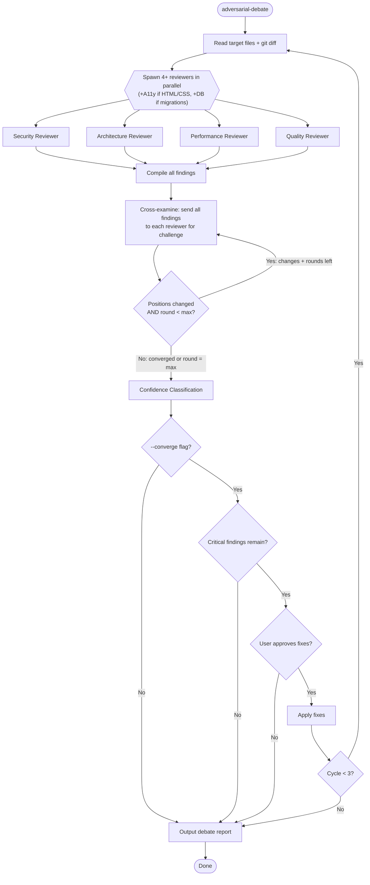

# /adversarial-debate — Multi-Reviewer Confidence-Classified Debate

4 specialized reviewers independently assess code, then cross-challenge each other's findings. Output is confidence-classified: findings that survive debate are HIGH confidence.

## Arguments

- `/adversarial-debate <file-or-glob>` — Standard 4-reviewer debate
- `/adversarial-debate --rounds N` — Set debate rounds (default: 2, max: 3)
- `/adversarial-debate --converge` — Enable convergence loop (fix + re-review, max 3 cycles)

## When to Use

This is Quality Gate Level 5-6 in the escalating review system:
- Level 1-2: Self-check + peer review (small changes)
- Level 3: Devil's advocate (/opponents-view)
- Level 4: Cross-model (/codex review)
- **Level 5**: This tool — adversarial debate (significant changes)
- Level 6-7: Bridge Briefing (/bridge-briefing)

Auto-triggered by `/evaluate` when change size exceeds thresholds.

## Workflow



### Key Decisions

**Reviewer perspectives** — each runs as a separate subagent for true independence:
- **Security**: OWASP Top 10, auth/authz gaps, input validation, data exposure, dependency risks
- **Architecture**: Design patterns, separation of concerns, coupling/cohesion, API contracts, backwards compatibility
- **Performance**: Algorithmic complexity, memory allocation, I/O efficiency, caching, DB query patterns
- **Quality**: Readability, error handling, test coverage, documentation, naming conventions

**Finding format**: Each finding must include severity (critical/warning/suggestion), confidence (HIGH/MEDIUM/LOW), file:line, description, fix suggestion.

**Debate protocol**: Each reviewer receives all other reviewers' findings and must label each response:
- **CHALLENGED**: Disagree with finding (explain why)
- **CONCEDED**: Missed this, other reviewer is right
- **DEFENDED**: Stand by own finding despite silence
- **RAISED**: New finding revealed by cross-examination

**Confidence classification**:
- **HIGH**: Unchallenged by all reviewers, or survived a challenge
- **MEDIUM**: Majority of reviewers agreed (e.g., 3/4, 4/5)
- **LOW**: Split opinion (e.g., 2-2, 2-3) — report both perspectives

**Conditional reviewers**: If changed files include HTML/CSS, add A11y reviewer. If DB migrations, add DB reviewer.

### Output Format

```markdown
## Adversarial Debate — {timestamp}

**Files**: {paths}
**Reviewers**: Security, Architecture, Performance, Quality
**Rounds**: {N} | **Converged**: {yes/no}

### HIGH Confidence Findings (unchallenged or survived debate)
1. [{severity}] {file}:{line} — {description}
   - Found by: {reviewer(s)}
   - Fix: {suggestion}

### MEDIUM Confidence Findings (majority agreed)
1. [{severity}] {file}:{line} — {description}
   - Agreed: {reviewers} | Disagreed: {reviewer}

### LOW Confidence Findings (split opinion)
1. [{severity}] {file}:{line} — {description}
   - For: {reviewer perspective}
   - Against: {reviewer perspective}

### Debate Log
- Round 1: {N} findings raised, {N} challenged, {N} conceded
- Round 2: {N} positions changed, {converged/continued}

### False Positives Caught
1. {finding} — challenged by {reviewer}, reason: {why it's fine}

**Summary**: {N} HIGH / {N} MEDIUM / {N} LOW findings across {N} files
```

## Token Cost

- Standard (2 rounds): ~15,000-25,000 tokens
- With convergence (3 cycles): ~30,000-50,000 tokens
- Always-on: 0 (loaded on demand only)

## Notes

- Each reviewer runs as a separate subagent for true independence
- Debate rounds prevent rubber-stamping — reviewers must actively engage with other findings
