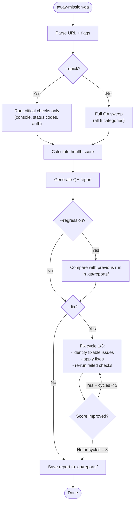

# /away-mission-qa -- Structured Browser QA

Automated QA mission against a live or staging URL. Produces a health score (0-100), runs fix cycles for issues found, and tracks regression between runs.

## Arguments

- `/away-mission-qa <url>` -- full QA sweep of target URL
- `/away-mission-qa <url> --quick` -- critical checks only (auth, 404s, console errors)
- `/away-mission-qa <url> --regression` -- compare against previous run
- `/away-mission-qa <url> --fix` -- auto-fix mode: attempt fixes and re-test (max 3 cycles)
- `/away-mission-qa <url> --checklist <path>` -- use custom checklist file

## Prerequisites

- Playwright MCP available (project-scoped `.mcp.json` or global)
- Target URL must be reachable from the current environment
- For `--fix` mode: write access to the project source code

## Health Score Formula

Score starts at 100, deductions per category:

| Category | Weight | Checks | Deduction per fail |
|----------|--------|--------|-------------------|
| Critical Errors | 30 | Console errors, JS exceptions, 4xx/5xx responses | -10 each (cap -30) |
| Navigation | 20 | Broken links, redirect chains, 404 pages | -5 each (cap -20) |
| Visual | 15 | Layout shifts, overflow, missing images, contrast | -3 each (cap -15) |
| Forms | 15 | Validation, submission, CSRF, error states | -5 each (cap -15) |
| Performance | 10 | LCP > 2.5s, CLS > 0.1, TBT > 200ms | -3 each (cap -10) |
| Accessibility | 10 | Missing alt text, unlabeled inputs, color contrast | -2 each (cap -10) |

**Thresholds**: 90-100 GREEN, 70-89 AMBER, 0-69 RED

## Workflow



## QA Check Details

### Critical Errors (weight: 30)

Using Playwright MCP or Bash with curl:

1. **Console errors**: Navigate to each page, capture `console.error` events
2. **HTTP status codes**: Check all pages return 200 (or expected redirect)
3. **JavaScript exceptions**: Capture uncaught exceptions during page load
4. **API failures**: Monitor network requests for 4xx/5xx responses
5. **Auth flow**: If login page exists, verify login/logout cycle works

### Navigation (weight: 20)

1. **Internal links**: Crawl all internal links from homepage (max 50 pages)
2. **Broken links**: Flag any link returning 404 or connection refused
3. **Redirect chains**: Flag chains > 2 hops
4. **Anchor links**: Verify `#fragment` targets exist on page

### Visual (weight: 15)

Using Playwright screenshots + visual inspection:

1. **Layout overflow**: Check for horizontal scrollbar on standard viewports (375px, 768px, 1280px)
2. **Missing images**: Find `` tags with broken `src`
3. **CLS**: Measure cumulative layout shift during page load
4. **Text contrast**: Check WCAG AA contrast ratios on visible text

### Forms (weight: 15)

1. **Empty submission**: Submit forms without filling required fields, verify error messages
2. **Validation messages**: Check client-side validation fires correctly
3. **Success state**: Submit with valid data, verify success response
4. **CSRF protection**: Check for CSRF token presence in forms

### Performance (weight: 10)

Using Lighthouse-style metrics (via Playwright performance API):

1. **LCP** (Largest Contentful Paint): threshold 2.5s
2. **CLS** (Cumulative Layout Shift): threshold 0.1
3. **TBT** (Total Blocking Time): threshold 200ms

### Accessibility (weight: 10)

1. **Image alt text**: All `` have `alt` attributes
2. **Form labels**: All inputs have associated `<label>` or `aria-label`
3. **Heading hierarchy**: No skipped heading levels (h1 -> h3)
4. **Keyboard navigation**: Tab order reaches all interactive elements

## Report Format

```markdown
## QA Report -- {url}

**Date**: {YYYY-MM-DD HH:mm}
**Health Score**: {score}/100 ({GREEN|AMBER|RED})
**Pages tested**: {count}
**Duration**: {seconds}s

### Score Breakdown

| Category | Score | Issues |
|----------|-------|--------|
| Critical Errors | {x}/30 | {count} |
| Navigation | {x}/20 | {count} |
| Visual | {x}/15 | {count} |
| Forms | {x}/15 | {count} |
| Performance | {x}/10 | {count} |
| Accessibility | {x}/10 | {count} |

### Issues Found

#### Critical
- [C-001] {description} -- {page URL}

#### Warnings
- [W-001] {description} -- {page URL}

#### Suggestions
- [S-001] {description} -- {page URL}

### Regression (if --regression)
| Metric | Previous | Current | Delta |
|--------|----------|---------|-------|
| Health Score | {prev} | {curr} | {+/-} |
| Critical Issues | {prev} | {curr} | {+/-} |

### Fix Cycles (if --fix)
| Cycle | Issues Fixed | Score Before | Score After |
|-------|-------------|-------------|-------------|
| 1 | {count} | {before} | {after} |
```

## Persistence

- Reports saved to `.qa/reports/{domain}-{YYYY-MM-DD-HHmm}.md`
- Previous reports used for `--regression` comparison (most recent matching domain)
- Create `.qa/` directory if it does not exist

## Custom Checklist

When `--checklist <path>` is provided, load a markdown file with custom checks:

```markdown
# Custom QA Checklist

- [ ] Homepage hero loads correctly
- [ ] Contact form submits without error
- [ ] Pricing page shows correct plans
- [ ] Blog posts render markdown properly
```

Each item is verified manually via Playwright navigation and added to the report.

## Worked Example

**User**: `/away-mission-qa https://staging.example.com --fix`

1. **Preflight**: URL reachable (200), Playwright available
2. **Full sweep**: 12 pages crawled, 6 categories tested
3. **Score**: 73/100 (AMBER)
   - Critical: 30/30 (no errors)
   - Navigation: 15/20 (1 broken link)
   - Visual: 12/15 (1 missing image)
   - Forms: 10/15 (contact form missing validation)
   - Performance: 4/10 (LCP 3.2s, CLS 0.15)
   - Accessibility: 2/10 (4 images missing alt, 2 unlabeled inputs)
4. **Fix cycle 1**: Fixed broken link href, added missing alt texts, added form validation
5. **Re-test**: Score improved to 88/100 (AMBER)
6. **Fix cycle 2**: Optimized hero image (LCP), fixed CLS with explicit dimensions
7. **Re-test**: Score improved to 94/100 (GREEN)
8. **Report saved**: `.qa/reports/staging.example.com-2026-03-23-1430.md`

Output: "Away mission complete. Health score: 94/100 (GREEN). 2 fix cycles applied. Report saved."

## Troubleshooting

| Symptom | Cause | Fix |
|---------|-------|-----|
| "Playwright MCP not available" | Not configured for this project | Add Playwright to `.mcp.json` or use `--curl-only` for HTTP-only checks |
| Score stuck at 0 | Site not reachable or returning 5xx | Verify URL is accessible; check VPN/firewall |
| Fix cycle makes no progress | Issues require manual intervention | Review report, fix manually, re-run with `--regression` |
| Regression comparison fails | No previous report found | Run a baseline first without `--regression` |
| Performance metrics unavailable | Playwright performance API not supported | Deduction skipped; score calculated from remaining categories |
| "Max pages reached" | Site has > 50 internal links | Expected; crawl limited to 50 pages for efficiency |
