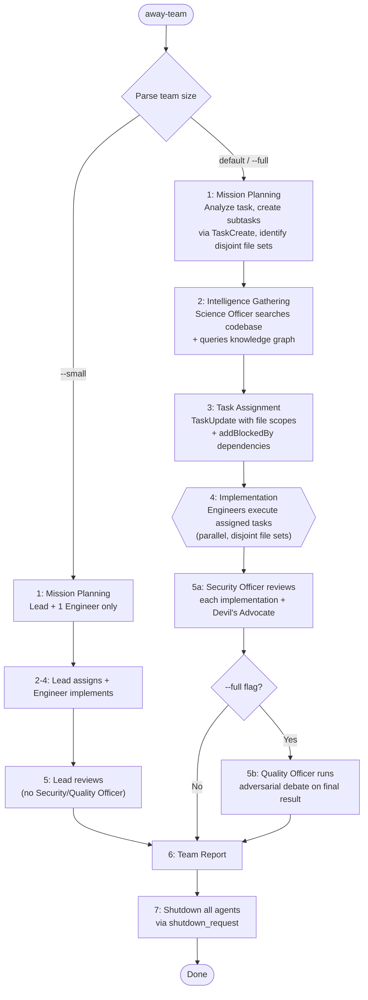

# /away-team — Standard Multi-Agent Team Pattern

Spawn a coordinated team for complex implementation tasks. The team lead coordinates, engineers implement, and reviewers validate.

## Arguments

- `/away-team "<task description>"` — Standard team (lead + 2-3 agents)
- `/away-team --small "<task>"` — Minimal team (lead + 1 agent)
- `/away-team --full "<task>"` — Full team (lead + 3 agents + reviewer)

## Team Composition

### Standard Team (default)

| Role | Model | Agent Type | Purpose |
|------|-------|-----------|---------|
| Team Lead | Opus | general-purpose | Coordinates, never implements directly |
| Engineer | Sonnet | sonnet-worker | Implements code changes |
| Security Officer | Sonnet | sonnet-reviewer | Reviews security implications |
| Science Officer | Haiku | haiku-explorer | Researches patterns and prior art |

### Small Team (--small)

| Role | Model | Agent Type | Purpose |
|------|-------|-----------|---------|
| Team Lead | Opus | general-purpose | Coordinates + reviews |
| Engineer | Sonnet | sonnet-worker | Implements all changes |

### Full Team (--full)

Standard team plus:

| Role | Model | Agent Type | Purpose |
|------|-------|-----------|---------|
| Quality Officer | Sonnet | sonnet-reviewer | Runs adversarial review on results |

## Workflow



### Key Decisions

**Mission Planning**: Team Lead analyzes task, breaks into subtasks with TaskCreate. File sets MUST be disjoint — no file assigned to multiple agents. Team Lead coordinates but never implements directly.

**Intelligence Gathering**: Science Officer (haiku-explorer) searches codebase for relevant patterns, checks knowledge graph for prior decisions, reports findings to Team Lead before task assignment.

**Task Assignment**: Each agent gets a clear scope with specific file paths. Include full file contents in agent prompts (agents have no shared context). Set dependencies via addBlockedBy so reviews block on implementation.

**Review**: Security Officer reviews each completed task, runs Devil's Advocate on design decisions, flags security concerns with severity ratings. Quality Officer (full team only) runs adversarial debate producing confidence-classified findings.

**Team Report format**:

```markdown
## Away Team Report — {timestamp}

**Mission**: {task description}
**Team**: {composition}
**Duration**: {time}

### Tasks Completed
| Task | Agent | Status | Files Modified |
|------|-------|--------|---------------|
| {task} | {agent} | {done/partial} | {files} |

### Review Findings
| Finding | Severity | Confidence | Reviewer |
|---------|----------|------------|---------|
| {finding} | {sev} | {HIGH/MED/LOW} | {who} |

### Decisions Made
- {decision 1 with rationale}

### Mission Status
{COMPLETE / PARTIAL — with explanation}
```

## Critical Rules

1. **Disjoint file sets**: NEVER assign the same file to multiple agents
2. **Full context in prompts**: Agents start fresh — include all needed file contents
3. **Verify by file existence**: Don't rely solely on task completion status
4. **Set Bash timeout**: Use 600000ms for long operations
5. **Hull integrity monitoring**: If any agent hits Red (33%+ context), trigger Relief on Station

## Troubleshooting

| Symptom | Cause | Fix |
|---------|-------|-----|
| Engineer agent can't run Bash commands | sonnet-worker lacks Bash tool permissions | Return Bash-requiring tasks to Team Lead (main agent) for execution |
| Two agents edit the same file | File sets not disjoint in task assignment | Re-assign: each file must belong to exactly one agent |
| Agent has no context about the codebase | Agent starts fresh; didn't receive file contents | Include full file contents in agent prompt — agents cannot share context |
| Team Lead tries to implement directly | Role confusion in prompt | Team Lead coordinates only; redirect implementation to Engineer agents |
| Agent hits Red hull integrity (33%+) mid-task | Large files or complex task consuming context | Trigger `/relief-on-station` for that agent; replace with fresh agent |

## Notes

- Team uses TeamCreate for coordination infrastructure
- JAVA_HOME on MINGW: `export JAVA_HOME="/c/Program Files/Eclipse Adoptium/jdk-17.0.17.10-hotspot"`
- sonnet-worker agents may have limited Bash capabilities — plan accordingly
- Token cost: ~20,000-40,000 tokens total (team lead + 3 agents + reviews)
- Always-on overhead: 0 (loaded on demand)
