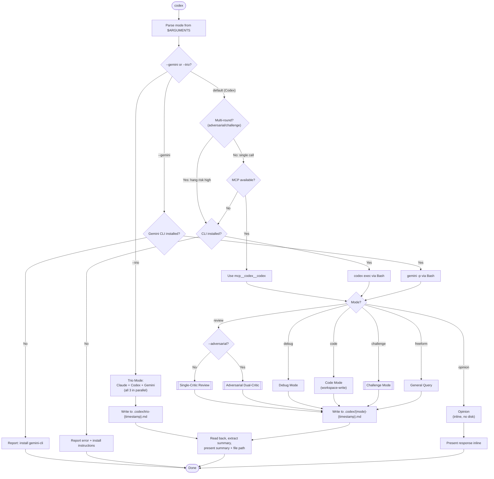
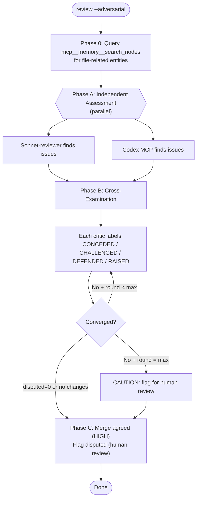
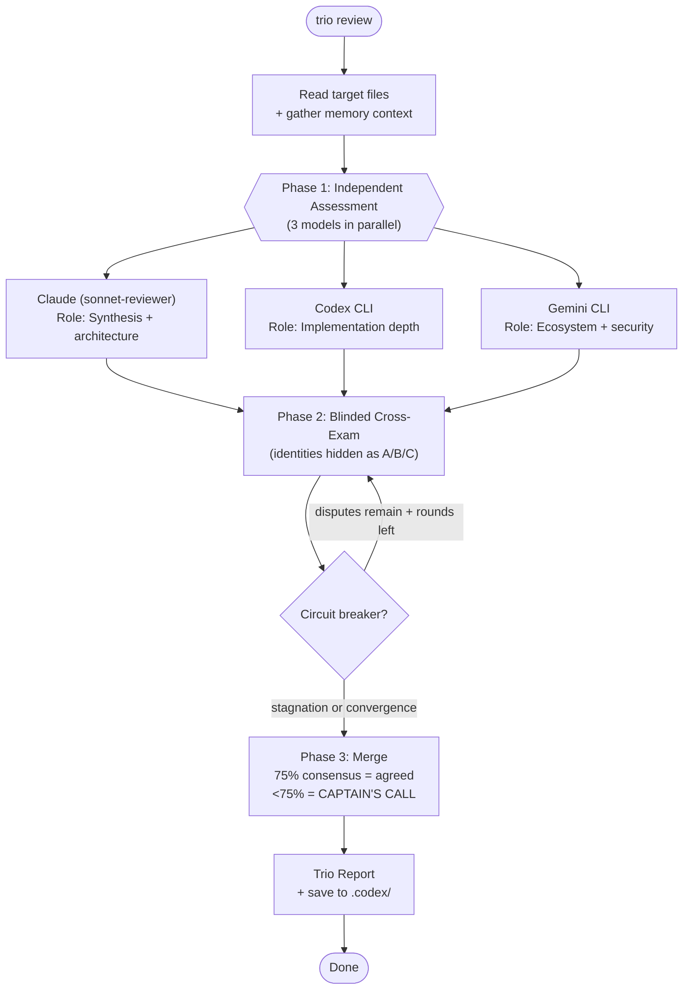

# /codex - Cross-Model Collaboration Skill

Unified interface for cross-model collaboration via Codex MCP/CLI and Gemini CLI.

## Arguments

Parse `$ARGUMENTS` to extract mode and context:

- `/codex review <file-or-glob>` - Code review (read-only, single-critic)
- `/codex review <file-or-glob> --adversarial` - Dual-critic adversarial code review
- `/codex debug <context>` - Debugging help (read-only)
- `/codex code <description>` - Code generation (workspace-write)
- `/codex opinion <question>` - Quick second opinion (inline, no disk)
- `/codex challenge <plan-file> [flags]` - Adversarial plan review (6-dimension critique)
- `/codex <freeform prompt>` - General query (read-only)

Optional flags (any mode):
- `--model MODEL` - Override model (default: `gpt-5.4` for Codex)
- `--thread THREAD_ID` - Continue an existing Codex thread
- `--gemini` - Use Gemini CLI instead of Codex
- `--trio` - Three-model adversarial review (Claude + Codex + Gemini)

Challenge-mode flags:
- `--internal` - Claude-only review
- `--codex` - Codex-only review (same `--gemini` flag applies to challenge mode too)
- `--iterations N` - Max critique rounds (default: 3)

Flag precedence:
- `--model` applies to Codex leg only. When combined with `--gemini`, it is ignored (Gemini auto-selects its model). When combined with `--trio`, it applies to the Codex leg only.
- `--trio` is restricted to `review` and `challenge` modes. For other modes (debug, code, opinion, freeform), emit: "Trio mode is only available for review and challenge. Use `--gemini` for single-model Gemini review."

## Effort Profile Gating

**Before invocation**: Read `~/.claude/cache/current-effort-profile.json`. If missing, assume `standard`.

- `/effort quick` — Single-model modes only (review, debug, opinion, freeform). Cap `--iterations 1`. Block `--trio` and `--adversarial`: "Cross-model review requires standard or thorough effort."
- `/effort standard` — All modes available. `--trio` allowed but not auto-suggested.
- `/effort thorough` — All modes available. Auto-suggest `--trio` for review and challenge modes.

## Output Strategy

**All modes except `opinion`** write full Codex output to disk:

1. Determine output directory:
   - In a project: `.codex/` in project root
   - Outside a project: `~/.claude/codex-output/`
2. Create directory if needed
3. Write full response to `{mode}-{YYYY-MM-DD-HHmm}.md`
4. Read the file back, extract actionable summary
5. Present summary + file path to user

**`opinion` mode** is inline only (short answers stay in context).

## Invocation: MCP (Primary)

Use the `mcp__codex__codex` tool:

```
mcp__codex__codex({
  prompt: "<constructed prompt — see mode sections below>",
  model: "<model flag or gpt-5.4>",
  config: {"model_reasoning_effort": "high"},
  sandbox: "<read-only or workspace-write>",
  approval_policy: "never"
})
```

For follow-ups, use `mcp__codex__codex-reply` with the `thread_id` from the initial response.

If MCP tools are unavailable (tool not found error), fall back to CLI.

## Invocation: CLI Fallback

If MCP fails, use `codex exec` via Bash:

```bash
# Step 1: Auth detection
AUTH_TYPE="none"
if [ -n "$OPENAI_API_KEY" ] || [ -n "$CODEX_API_KEY" ]; then
    AUTH_TYPE="apikey"
elif codex login status 2>&1 | grep -q "Logged in"; then
    AUTH_TYPE="chatgpt"
fi

if [ "$AUTH_TYPE" = "none" ]; then
    echo "ERROR: No Codex auth. Run 'codex login' or set OPENAI_API_KEY."
    exit 1
fi

# Step 2: Write prompt to secure temp file
CODEX_TMPFILE=$(mktemp "${TMPDIR:-${TEMP:-/tmp}}/codex-prompt.XXXXXX")
CODEX_OUTFILE=$(mktemp "${TMPDIR:-${TEMP:-/tmp}}/codex-output.XXXXXX")
trap 'rm -f "$CODEX_TMPFILE" "$CODEX_OUTFILE"' EXIT

cat > "$CODEX_TMPFILE" << 'PROMPT_EOF'
<constructed prompt>
PROMPT_EOF

# Step 3: Execute (stdin redirection, not shell expansion)
codex exec \
  -m <model or gpt-5.4> \
  -c model_reasoning_effort="high" \
  -c model_reasoning_summary="auto" \
  -s <sandbox> \
  --skip-git-repo-check \
  < "$CODEX_TMPFILE" > "$CODEX_OUTFILE" 2>&1

cat "$CODEX_OUTFILE"
```

**ChatGPT session auth restriction**: When AUTH_TYPE="chatgpt", only use `gpt-5.4`, `gpt-5.3-codex`, `gpt-5.2`, or omit the `-m` flag. Do NOT use `o4-mini` (returns 400 error).

If CLI also fails (not installed), report clear error with install instructions.

## Invocation: Gemini CLI

When `--gemini` flag is set, use Google Gemini CLI instead of Codex:

```bash
# Step 1: Check Gemini CLI availability
if ! command -v gemini &>/dev/null; then
    echo "ERROR: Gemini CLI not installed. Run 'npm install -g @google/gemini-cli' or visit https://github.com/google-gemini/gemini-cli"
    exit 1
fi

# Step 2: Write prompt to secure temp file
GEMINI_TMPFILE=$(mktemp "${TMPDIR:-${TEMP:-/tmp}}/gemini-prompt.XXXXXX")
GEMINI_OUTFILE=$(mktemp "${TMPDIR:-${TEMP:-/tmp}}/gemini-output.XXXXXX")
trap 'rm -f "$GEMINI_TMPFILE" "$GEMINI_OUTFILE"' EXIT

cat > "$GEMINI_TMPFILE" << 'PROMPT_EOF'
<constructed prompt>
PROMPT_EOF

# Step 3: Execute in non-interactive mode (pipe prompt via stdin)
cat "$GEMINI_TMPFILE" | gemini \
  --approval-mode plan \
  -o text > "$GEMINI_OUTFILE" 2>&1

cat "$GEMINI_OUTFILE"
```

**Key flags**: `-p` for non-interactive (pipe mode), `--approval-mode plan` for read-only by convention (plan approval prompt, not an OS-level sandbox), `-o text` for plain text output. Gemini CLI uses Google AI Studio or Vertex auth (configured via `gemini auth`).

**Large prompt guard**: Shell argument expansion has an `ARG_MAX` limit. For prompts > 100KB, truncate the file content to the most relevant sections or split across multiple calls.

**Model selection**: Gemini CLI auto-selects its best model. No `-m` flag needed unless the user specifies `--model`.

## Workflow



### Invocation Routing (Hang Prevention)

MCP stdio transport has known hanging issues (Claude Code #15945, #424, #3033). Route by hang risk:

| Mode | Rounds | Route | Rationale |
|------|--------|-------|-----------|
| opinion | 1 | MCP | Single call, fast |
| review (single) | 1 | MCP | Single call |
| debug | 1 | MCP | Single call |
| freeform | 1 | MCP | Single call |
| code | 1 | MCP | Needs workspace-write sandbox |
| review --adversarial | 3-6 | **CLI** | Multi-round cross-exam, each call = hang risk |
| challenge (default) | 3-6 | **CLI** | Multi-round dialogue, high token volume |
| challenge --internal | 1 | MCP OK | Single critic, no dialogue |
| challenge --codex | 1-3 | **CLI** | Codex-only still iterates |
| challenge --gemini | 1-3 | **CLI** | Gemini-only still iterates |
| any mode --gemini | 1 | **Gemini CLI** | Direct Gemini invocation |
| any mode --trio | 3-9 | **CLI** (all 3) | Parallel 3-model, highest hang risk |

**Hang recovery**: If an MCP call appears stuck (no response >90s), the user should interrupt (Ctrl+C the tool call). Retry the same prompt via CLI fallback.

## Mode: review

**Sandbox**: read-only
**Output**: `.codex/review-{timestamp}.md`

### Single-Critic (default)

Read the target file(s), then construct this prompt:

```
You are a senior code reviewer performing an adversarial review. Your job is to FIND PROBLEMS, not validate the code.

FILE: <path>
```
<full file contents>
```

You MUST find at least 3 issues. If the code appears solid, look harder at:
- Assumptions that could break under different inputs
- Missing error paths or edge cases
- Thread safety, race conditions, or state management
- Implicit coupling or hidden dependencies
- What happens when external services are slow, down, or return unexpected data

For each issue:
- severity: critical | warning | suggestion
- confidence: high | medium | low (how certain are you this is a real issue?)
- line(s): approximate location
- description: what's wrong and WHY it matters
- fix: concrete code change to address it
- what_if_ignored: consequence of not fixing

Then score on 5 dimensions (1-10 each):
CORRECTNESS: {score} — Does the code do what it claims? Logic bugs, off-by-ones, wrong assumptions?
COMPLETENESS: {score} — Are all cases handled? Missing error paths, untested branches, TODOs?
SECURITY: {score} — Injection, auth bypass, secret leaks, SSRF, unsafe deserialization?
CONSISTENCY: {score} — Follows project conventions? Naming, patterns, error handling style?
FEASIBILITY: {score} — Will it work in production? Performance, scaling, resource usage, dependencies?

End with a summary:
ISSUES: {critical_count} critical, {warning_count} warnings, {suggestion_count} suggestions
DIMENSIONS: C={correctness}/10 Co={completeness}/10 S={security}/10 Cn={consistency}/10 F={feasibility}/10
VERDICT: APPROVE (all >= 7) | CONCERNS (any 4-6) | REJECT (any <= 3)
OVERALL_CONFIDENCE: {1-10} — how confident are you in this review's thoroughness?
BLINDSPOTS: list 1-2 areas you're uncertain about (what you might have missed)
```

After receiving response, write to disk, summarize: issue count by severity + confidence level + top 3 findings.

### Adversarial Dual-Critic (`--adversarial` flag)



#### Key Decisions

**Phase 0 — Memory Context**: Query `mcp__memory__search_nodes` for entities related to the files (module name, feature area, prior decisions). Include relevant context in both critics' prompts.

**Cross-Examination prompt** (sent to each critic each round, configurable via `--iterations N`):

```
Round {N} of adversarial cross-examination.

The other reviewer found these issues:
{other_critic_issues}

Your issues were:
{your_issues}

TASK:
- Which of THEIR issues are valid that you missed? (CONCEDED)
- Which of THEIR issues are false positives? Explain why. (CHALLENGED)
- Which of YOUR issues do you maintain despite their silence? (DEFENDED)
- Any NEW issues revealed by this cross-examination? (RAISED)

You MUST challenge at least 1 of their findings — do not rubber-stamp.

Re-list all issues with updated confidence levels.
OVERALL_CONFIDENCE: {1-10} — updated after seeing other reviewer's work
CONVERGENCE_DELTA: list issues where you changed your position this round
```

**Convergence**: disputed count = 0 OR no positions changed → consensus reached. Early exit if OVERALL_CONFIDENCE >= 8 from both after round 1. Max 3 rounds, then flag for human review with CAUTION banner.

**Circuit Breaker** (stagnation detection, checked in priority order):
1. **Convergence** (happy path): All critics' CONVERGENCE_DELTA is empty for a round → consensus reached, exit cleanly (no CAUTION banner)
2. **Persistent disputes**: 5+ findings disputed across rounds → emit `CAUTION: unresolvable disagreement`, present both positions for human review
3. **Stagnation**: 3 rounds with no new fixes applied → soft exit with advisory note, emit final report

**Blinded Consensus** (anti-sycophancy):
In cross-examination prompts, do NOT reveal which model produced which findings. Present them as "Reviewer A" and "Reviewer B" — never "Claude" or "Codex" or "Gemini". This prevents rubber-stamping based on perceived model authority rather than evidence quality.

#### Adversarial Review Output

```markdown
## Adversarial Code Review — Consensus Report

**Files**: {paths}
**Rounds**: {N} | **Convergence**: {yes/no}

### Agreed Issues (both critics concur — HIGH confidence)
1. [severity] line:N — {description}

### Disputed Issues (critics disagree — flag for human review)
1. [severity] line:N — {description}
   - Reviewer A says: {position}
   - Reviewer B says: {position}

### Conceded Issues (one critic found, other agreed after cross-exam)
1. [severity] line:N — found by {who}, conceded by {who}

### False Positives Caught (one critic flagged, other successfully challenged)
1. line:N — {originally flagged as} → {why it's actually fine}

**Confidence**: {1-10} overall | Reviewer A: {1-10} | Reviewer B: {1-10}
**Blindspots**: {areas neither critic is confident about}
```

## Mode: debug

**Sandbox**: read-only
**Output**: `.codex/debug-{timestamp}.md`

Gather context automatically: recent error messages, relevant file contents, stack traces.

```
You are a debugging expert. Analyze this problem and find the root cause.

PROBLEM: <user's description or recent error>

RELEVANT CODE:
<file contents>

ERROR OUTPUT:
<recent errors/stack traces>

Provide:
1. Root cause analysis
2. Step-by-step fix
3. How to verify the fix
4. What caused the confusion (why was this hard to debug?)
```

After response, write to disk, present root cause summary + recommended fix.

## Mode: code

**Sandbox**: workspace-write
**Output**: `.codex/code-{timestamp}.md`

Read relevant existing files for context, then:

```
You are a code generation expert. Write code for the following task.

TASK: <user's description>

EXISTING CONTEXT:
<relevant file snippets>

Requirements:
- Write clean, production-quality code
- Follow existing code style and conventions
- Include necessary imports
- Handle errors appropriately
- Do NOT over-engineer
```

**Important**: This is the only mode that uses `workspace-write` sandbox. Codex may modify files directly. After completion, review what changed.

## Mode: opinion

**Sandbox**: read-only
**Output**: Inline only (no disk write)

```
Quick question for a second opinion:

<user's question>

Give a concise, direct answer. If there are trade-offs, list them briefly.
```

Present the response directly in context (no file write needed for short answers).

## Mode: challenge

**Sandbox**: read-only
**Output**: `.codex/challenge-{timestamp}.md`
**Full reference**: See [challenge-mode.md](challenge-mode.md) for scoring rubric, prompts, convergence logic, and output format.

Absorbs the former `/challenge-plan` command. Supports `--internal`, `--iterations N`, `--model MODEL`.

**Quick reference**: 6-dimension scoring (Goal Alignment 1.5x, Completeness 1.5x, Feasibility 1.0x, Dependencies 1.0x, Risk & Gaps 1.0x, Over-engineering 0.5x). Thresholds: >= 9.0 PASS, 8.0-8.9 PAUSE, < 8.0 AUTO-FIX. Max 3 cycles. Default mode launches both sonnet-reviewer and Codex in parallel with adversarial dialogue.

## Mode: trio (`--trio` flag)

Three-model adversarial review: Claude + Codex + Gemini in parallel, then cross-examination.

**Sandbox**: read-only
**Output**: `.codex/trio-{timestamp}.md`
**Route**: CLI for Codex + Gemini; Claude reviews in-context



### Role-Based Prompts

When constructing prompts for `--trio` mode, assign each model a specialized lens:

| Model | Role | Prompt Prefix |
|-------|------|---------------|
| Claude (sonnet-reviewer) | Synthesis & architecture | "Focus on architectural coherence, coupling, abstraction quality, and how components interact." |
| Codex | Implementation depth | "Focus on implementation correctness, edge cases, error handling, and code-level bugs." |
| Gemini | Ecosystem & security | "Focus on dependency risks, security vulnerabilities, API misuse, and ecosystem best practices." |

Each reviewer still performs a full review — the role just biases their attention. The blinded cross-examination then challenges across these perspectives.

### Trio Cross-Examination Prompt

```
Round {N} of trio cross-examination.

Two other reviewers found these issues:

Reviewer {X} findings:
{reviewer_X_issues}

Reviewer {Y} findings:
{reviewer_Y_issues}

Your findings were:
{your_issues}

TASK:
- Which of THEIR issues are valid that you missed? (CONCEDED)
- Which of THEIR issues are false positives? Explain why. (CHALLENGED)
- Which of YOUR issues do you maintain? (DEFENDED)
- Any NEW issues revealed by this cross-examination? (RAISED)

You MUST challenge at least 1 finding from each other reviewer.

Re-list all issues with updated confidence levels.
OVERALL_CONFIDENCE: {1-10}
CONVERGENCE_DELTA: list issues where you changed position
```

**Note**: Trio mode makes up to 9 API calls (3 models x 3 rounds). Verify Codex and Gemini quota before invoking on large files. Use `--iterations 1` to cap at 3 calls for quick checks.

### Consensus Gate

- **75%+ agreement** (2/3 or 3/3 reviewers concur): finding is **AGREED** — high confidence
- **<75% agreement** (1/3): finding flagged as **CAPTAIN'S CALL** — presented with all positions for human decision
- Writer-reviewer separation enforced: the model that generated code is never the sole reviewer of that code

### Trio Report Format

```markdown
## Trio Review — {timestamp}

**Files**: {paths}
**Models**: Claude (synthesis) | Codex (implementation) | Gemini (ecosystem)
**Failed models**: {list or "none"}
**Rounds**: {N} | **Convergence**: {yes/no}

### Unanimous Findings (3/3 agree — HIGHEST confidence)
1. [severity] line:N — {description}

### Majority Findings (2/3 agree — HIGH confidence)
1. [severity] line:N — {description}
   - Dissent from {Reviewer X}: {reason}

### Captain's Call (1/3 — requires human review)
1. [severity] line:N — {description}
   - A says: {position}
   - B says: {position}
   - C says: {position}

### Cross-Model Insights (unique perspective from role specialization)
1. {insight revealed by role-specific analysis}

**Model Confidence**: Claude {1-10} | Codex {1-10} | Gemini {1-10}
**Blindspots**: {areas no model is confident about}
```

## Thread Support

When Codex returns a `thread_id`, save it and mention it to the user. For follow-up questions:

```
mcp__codex__codex-reply({
  thread_id: "<saved thread_id>",
  prompt: "<follow-up question>"
})
```

This avoids re-sending full context for multi-turn debugging.

## Worked Examples

### Example 1: Single-critic Codex review

**User**: `/codex review src/auth/session.ts`

**What happens**:
1. Parses mode as `review` (single-critic, no `--adversarial` flag)
2. Routes to MCP (single call, low hang risk)
3. Reads `src/auth/session.ts`, constructs adversarial review prompt
4. Calls `mcp__codex__codex` with `sandbox: "read-only"`
5. Writes full response to `.codex/review-2026-03-07-1430.md`
6. Presents summary:

```
Codex Review: src/auth/session.ts
ISSUES: 0 critical, 2 warnings, 1 suggestion
OVERALL_CONFIDENCE: 7/10

Top findings:
1. [warning] line:42 — Session token not invalidated on password change
2. [warning] line:67 — Cookie SameSite attribute missing
3. [suggestion] line:23 — Consider using crypto.timingSafeEqual for token comparison

Full report: .codex/review-2026-03-07-1430.md
Thread ID: thread_abc123 (use --thread for follow-up)
```

### Example 2: Gemini review

**User**: `/codex review src/api/routes.ts --gemini`

**What happens**:
1. Parses mode as `review`, detects `--gemini` flag
2. Routes to Gemini CLI (bypasses Codex entirely)
3. Reads file, constructs review prompt
4. Runs `gemini -p "<prompt>" --approval-mode plan -o text`
5. Writes output to `.codex/review-2026-03-07-1445.md`
6. Presents summary with Gemini-specific findings

### Example 3: Trio adversarial review

**User**: `/codex review src/auth/*.ts --trio`

**What happens**:
1. Parses mode as `review`, detects `--trio` flag
2. Launches 3 reviewers in parallel:
   - Claude sonnet-reviewer (architecture lens)
   - Codex CLI (implementation lens)
   - Gemini CLI (ecosystem/security lens)
3. Collects independent findings, anonymizes as Reviewer A/B/C
4. Runs blinded cross-examination (circuit breaker at 3 rounds)
5. Merges with 75% consensus gate
6. Writes to `.codex/trio-2026-03-07-1500.md`
7. Presents: unanimous findings, majority findings, captain's calls

## Troubleshooting

| Symptom | Cause | Fix |
|---------|-------|-----|
| MCP call hangs (no response >90s) | Known MCP stdio transport issue | User interrupts (Ctrl+C), retry via CLI fallback |
| "400 error" with o4-mini model | ChatGPT session auth doesn't support o4-mini | Use `gpt-5.4` or omit `--model` flag; o4-mini requires API key auth |
| Codex returns empty response | Prompt too large for sandbox constraints | Reduce file content in prompt; send only relevant sections |
| Thread ID not working | Previous thread expired or MCP restarted | Start fresh conversation without `--thread`; full context reconstructed |
| Adversarial review hangs mid-round | MCP stdio hang on multi-round calls | Use CLI route for `--adversarial` and `challenge` modes (automatic) |
| `gemini: command not found` | Gemini CLI not installed | `npm install -g @google/gemini-cli` or check PATH |
| Gemini returns auth error | No Google AI Studio or Vertex credentials | Run `gemini auth` to configure authentication |
| Trio mode missing one model's output | One CLI call failed silently | Check both `codex` and `gemini` are installed and authenticated; fallback to dual-critic |
| Cross-exam converges too fast (round 1) | Blinded consensus working — models agree | Normal; 3/3 unanimous findings are high confidence |
| Circuit breaker fires at round 3 | Persistent disagreement between models | Expected; review CAPTAIN'S CALL items manually |

## Error Handling

- **MCP tool not found**: Fall back to CLI silently
- **MCP hang (no response >90s)**: User interrupts, retry via CLI. Log: "MCP unresponsive, switching to CLI fallback"
- **MCP error/crash**: Fall back to CLI, report MCP error for diagnostics
- **Codex CLI not installed**: Report with install instructions (`npm install -g @openai/codex`)
- **Gemini CLI not installed**: Report with install instructions (`npm install -g @google/gemini-cli`)
- **Codex auth failure**: Suggest `codex login` or setting `OPENAI_API_KEY`
- **Gemini auth failure**: Suggest `gemini auth` to configure credentials. If error mentions "API key", user needs Google AI Studio setup. If error mentions "service account" or "project", user needs Vertex AI setup.
- **Timeout**: Warn user, suggest simpler prompt or `--model o4-mini` (API key auth only, not ChatGPT session)
- **Both fail**: Report clearly, suggest manual workaround
- **Trio mode partial failure**: If 1 of 3 models fails, degrade gracefully to dual-critic with remaining 2 models. Note which model failed in the report header.

### CLI Fallback for Multi-Round Operations

For adversarial/challenge modes that require multiple Codex calls, use CLI throughout (not just as fallback). Each `codex exec` call is independent — no thread state, but avoids cumulative MCP hang risk. Reconstruct full context in each prompt rather than relying on thread_id.

### Attribution

Cross-model patterns extracted from community research:
- Circuit breaker (stagnation detection): adapted from [alecnielsen/adversarial-review](https://github.com/alecnielsen/adversarial-review)
- Blinded consensus (anti-sycophancy): adapted from [nyldn/claude-octopus](https://github.com/nyldn/claude-octopus)
- Writer-reviewer separation: adapted from [dsifry/metaswarm](https://github.com/dsifry/metaswarm)
