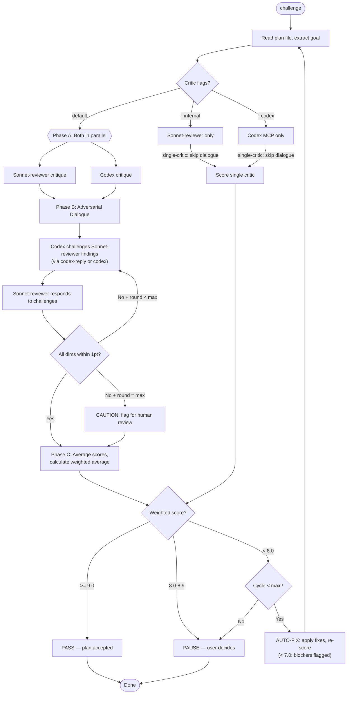

# Challenge Mode — Detailed Reference

**Parent skill**: `/codex challenge <plan-file> [flags]`

## Scoring Rubric (6 Dimensions, Weighted)

| Dimension | Weight | 10 | 7-9 | 4-6 | 1-3 |
|-----------|--------|-----|-----|-----|-----|
| Goal Alignment | 1.5x | Every section advances goal | 90%+ aligned | 70-89% | <70% |
| Completeness | 1.5x | All requirements covered | 1-2 minor gaps | Several gaps | Major gaps |
| Feasibility | 1.0x | All steps executable | Minor assumptions | Some unclear | Major blockers |
| Dependencies | 1.0x | Perfect ordering | 90%+ correct | Some issues | Circular deps |
| Risk & Gaps | 1.0x | All risks mitigated | Minor gaps | Partial coverage | Unaddressed risks |
| Over-engineering | 0.5x | Optimally simple | Slightly heavy | Unnecessarily complex | Severely over-built |

**Weighted score** = (D1x1.5 + D2x1.5 + D3x1.0 + D4x1.0 + D5x1.0 + D6x0.5) / 6.5

## Threshold Logic (Hybrid Mode)

| Score | Action |
|-------|--------|
| >= 9.0 | **PASS** — plan accepted, stop iterating |
| 8.0-8.9 | **PAUSE** — show score + issues, user decides: accept or refine |
| 7.0-7.9 | **AUTO-FIX** — apply fixes automatically, re-score (no user pause) |
| < 7.0 | **AUTO-FIX** — blockers found, apply fixes automatically, re-score |

Max 3 full cycles (configurable via `--iterations`).

## Challenge Workflow



## Key Decisions

**Assessment prompt** (used by BOTH critics in Phase A):

```
You are a critical plan reviewer. Analyze this plan against 6 dimensions.

PLAN GOAL: <extracted goal>

PLAN CONTENT:
<full plan text>

REVIEW DIMENSIONS:
1. Goal Alignment - Does every section advance the stated goal?
2. Completeness - Are all requirements covered? Missing steps?
3. Feasibility - Can each step actually be executed?
4. Dependencies - Are steps in the right order? Missing prerequisites?
5. Risk & Gaps - What could go wrong? What's unaddressed?
6. Over-engineering - Is anything unnecessarily complex?

For each issue found, provide:
- dimension: which of the 6
- severity: blocker | warning | suggestion
- description: what the problem is
- fix_hint: how to address it

Be specific. Reference exact sections. Do NOT rubber-stamp.
Format as structured list grouped by severity.

After your critique, score each dimension 1-10 WITH confidence:
SCORES:
- Goal Alignment: [1-10] (confidence: high|medium|low) — [brief justification]
- Completeness: [1-10] (confidence: high|medium|low) — [brief justification]
- Feasibility: [1-10] (confidence: high|medium|low) — [brief justification]
- Dependencies: [1-10] (confidence: high|medium|low) — [brief justification]
- Risk & Gaps: [1-10] (confidence: high|medium|low) — [brief justification]
- Over-engineering: [1-10] (confidence: high|medium|low) — [brief justification]
WEIGHTED_SCORE: [calculated per formula above]
OVERALL_CONFIDENCE: [1-10] — how confident are you in this review's thoroughness?
BLINDSPOTS: list 1-2 areas you're uncertain about or couldn't fully assess
```

**Critic dispatch**: `--internal` uses Task(sonnet-reviewer) only (fall back to inline Claude if unavailable). `--codex` uses Codex MCP/CLI only. Default launches BOTH in parallel, cross-references.

**Codex Challenge prompt** (Phase B, sent via `mcp__codex__codex-reply` or `mcp__codex__codex`):

```
The other reviewer (Internal) assessed this plan and found:
{internal_scores_and_issues}

Your previous assessment was:
{codex_scores_and_issues}

TASK: Engage critically with Internal reviewer's findings.
- Challenge scores you believe are too high or too low (cite evidence)
- Concede where Internal reviewer found genuine issues you missed
- Defend your findings that Internal reviewer disagreed with (cite plan sections)
- Raise any new issues this cross-examination reveals

Re-score all 6 dimensions with updated justifications.
Mark each dimension: AGREED | CONCEDED | DEFENDED | RAISED
```

**Internal Response prompt** (sent to sonnet-reviewer or inline Claude):

```
Codex has challenged your assessment:
{codex_rebuttal}

TASK: Respond to each challenge.
- Accept challenges where Codex has a valid point (mark CONCEDED)
- Push back where you maintain your position (mark DEFENDED, cite evidence)
- Note any new issues Codex raised that you agree with (mark AGREED)

Re-score all 6 dimensions with updated justifications.
```

**Convergence**: All dimensions within 1 point = consensus. Early exit if weighted average >= 9.0 and all deltas <= 1 after any round. Max 3 dialogue rounds (~60K tokens budget). Thread Fallback: if `mcp__codex__codex-reply` fails, use `mcp__codex__codex` with full context each call.

**Consensus scoring**: Final scores = average of last Internal + Codex per dimension. Calculate weighted average per formula. For `--internal` or `--codex` (single-critic), skip dialogue, output simplified score table with one column. If revising (score < 8.0), spawn sonnet-worker to apply fixes (or inline if unavailable), loop up to max_iterations.

## Consensus Output Format

```markdown
## Plan Quality Score — Consensus Report

**Dialogue Rounds**: {N} ({converged after round N / flagged for human review})

| Dimension | Internal | Codex | Delta | Consensus | Status |
|-----------|----------|-------|-------|-----------|--------|
| Goal Alignment (1.5x) | {score} | {score} | {delta} | {avg} | {AGREED/CONCEDED/DEFENDED} |
| Completeness (1.5x) | {score} | {score} | {delta} | {avg} | {status} |
| Feasibility (1.0x) | {score} | {score} | {delta} | {avg} | {status} |
| Dependencies (1.0x) | {score} | {score} | {delta} | {avg} | {status} |
| Risk & Gaps (1.0x) | {score} | {score} | {delta} | {avg} | {status} |
| Over-engineering (0.5x) | {score} | {score} | {delta} | {avg} | {status} |

**Weighted Average: {score}/10** — {Excellent/Good/Needs Work/Poor}
**Threshold: {9.0}** — {PASS/PAUSE/AUTO-FIX}

### Consensus Issues (both models agreed after dialogue)
1. {issue}

### Resolved Disagreements
1. {Internal/Codex conceded to other on X because Y}

### Unresolved (>1pt apart after dialogue)
1. {None / flagged items}

### Dialogue Log
- Round 1: {summary}
- Round 2: {summary}
- Convergence: {status}
```
