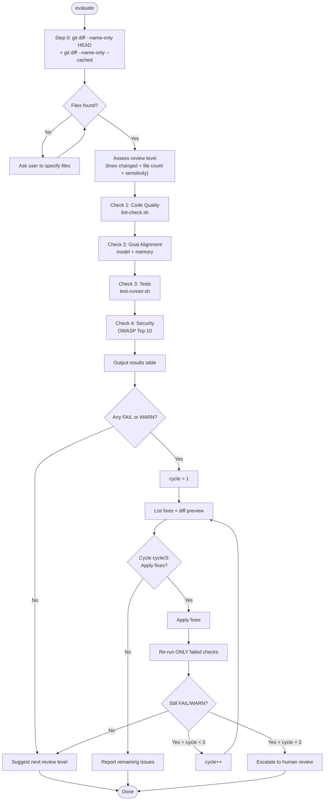

# Evaluate — Quality Gate Skill

Run 4 quality checks on recently modified files. Identify issues. Fix them with user approval.

## When to Use

- After implementing any feature or bug fix
- Before committing or creating a PR
- When uncertain about code quality

## Auto-Scaling Review Intensity

Before running checks, determine review level based on change scope:

```
Lines changed < 50  AND files <= 2  → Level 1-2 (self-check + peer)
Lines changed 50-200 AND files 2-5  → Level 1-3 (+ devil's advocate)
Lines changed 200-500 AND files 5-10 → Level 1-5 (+ adversarial debate)
Lines changed > 500 OR files > 10   → Level 1-7 (full bridge briefing)
```

Override minimums for sensitive files:
- Security files (auth, permissions, crypto) → minimum Level 5
- API changes (endpoints, contracts) → minimum Level 4
- DB migrations → minimum Level 5
- Config/infrastructure → minimum Level 4

After running the 4 checks below, suggest the appropriate next review level based on this scaling.

## Workflow



### Key Decisions

**Check 1 -- Code Quality**: Run `~/.claude/scripts/lint-check.sh <modified-files>`. Parse JSON: PASS if `status == "pass"`, FAIL with each `issues` item.

**Check 2 -- Goal Alignment**: Query `mcp__memory__search_nodes` for entities related to modified files/modules before evaluating. Verify: (1) code matches request, (2) no unrequested additions, (3) no missing requirements, (4) aligns with knowledge graph decisions. Report ALIGNED or MISALIGNED with specific divergences.

**Check 3 -- Integration/Tests**: Run `~/.claude/scripts/test-runner.sh`. Parse JSON: PASS if `status == "pass"`, FAIL with `failures` array + counts.

**Check 4 -- Security**: Scan modified files only for OWASP Top 10:
- Command injection (unsanitized shell input)
- XSS (unescaped output in HTML context)
- SQL injection (string-concatenated queries)
- Hardcoded secrets (API keys, passwords, tokens)
- Path traversal (user input in file paths)

Report PASS or WARN with `file:line` references.

---

## Results Format

After all 4 checks, output a summary table:

```
## Evaluate Results

| Check           | Status | Notes                          |
|-----------------|--------|--------------------------------|
| Code Quality    | PASS   | eslint: 0 issues               |
| Goal Alignment  | PASS   | All requirements addressed     |
| Tests           | FAIL   | 2 failures: test_auth, test_db |
| Security        | WARN   | Possible XSS at src/render.js:42 |
```

---

## Fix Loop

Escalation message after 3 cycles: "These issues require human review after 3 fix cycles: [list]"

---

## Notes

- Scripts auto-detect project type (Node, Python, Rust, Go)
- If scripts not found, skip that check and note it
- Security check covers modified files only — not full codebase scan
- Goal alignment check requires the original request to be visible in conversation
