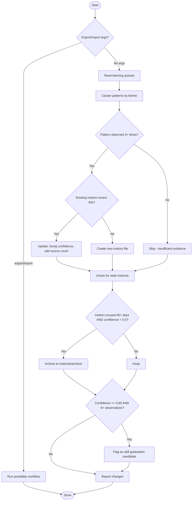

# Evolve Yourself

Promote observed patterns into instinct files that get auto-injected into subagents via the `instinct-injector.js` hook.

## When to Use

- After several sessions of work (weekly cadence)
- When user says "evolve", "update instincts", "learn from patterns"
- After `/borg-assimilate` or `/reflect` to promote high-confidence findings

## Workflow



## Key Decisions

- **Promotion threshold**: 3+ observations of the same pattern across 2+ sessions
- **Confidence scoring**: starts at 0.6 for new instincts, increases by 0.1 per additional observation (capped at 0.99)
- **Staleness**: instincts unused for 90+ days with confidence < 0.5 get archived, not deleted
- **Never auto-delete**: always archive so human can review and restore
- **Instinct cap**: max 20 files (instinct-injector enforces this too)

## Data Sources

Read these files to find patterns:

| File | Contents | Pattern Signal |
|------|----------|----------------|
| `~/.claude/cache/learnings-queue.json` | Corrections and positive feedback | "correction" type = something done wrong repeatedly |
| `~/.claude/cache/observations-queue.json` | Tool patterns and error-fix pairs | "error-fix" type = debugging pattern worth codifying |
| `~/.claude/cache/session-learnings.json` | Auto-extracted learnings | Themed clusters of similar learnings |
| `~/.claude/cache/gate-usage-log.json` | Quality gate invocations | Gates that catch issues = patterns to prevent |

## Instinct File Format

Each instinct is a markdown file in `~/.claude/instincts/`:

```markdown
**Confidence**: 0.75
**Source**: evolve-yourself (5 observations across 3 sessions)
**Created**: 2026-02-27
**Last validated**: 2026-02-27

Brief, actionable behavioral rule (1-3 sentences).
What to do or what NOT to do.
```

Required fields:
- `**Confidence**`: 0.0-0.99 (instinct-injector rejects files without this)
- `**Source**`: which pipeline promoted this
- Rule text: clear, imperative, no ambiguity

## Execution Steps

### 1. Read all queues

```
Read ~/.claude/cache/learnings-queue.json
Read ~/.claude/cache/observations-queue.json
Read ~/.claude/cache/session-learnings.json (first 200 lines)
```

### 2. Cluster patterns

Group entries by theme. Look for:
- Same correction made 3+ times (e.g., "always run tests before committing")
- Same error-fix pattern repeated (e.g., "check WSL path format")
- Same tool sequence repeated (e.g., "Read before Edit")

### 3. Check existing instincts

```
Read all files in ~/.claude/instincts/*.md
```

For each cluster:
- If an existing instinct covers it: update confidence (+0.1 per new observation, cap 0.99), update source count
- If no instinct covers it: create new file

### 4. Prune stale instincts

For each existing instinct:
- Parse `Created` and `Last validated` dates
- If >90 days since last validated AND confidence < 0.5:
  - Move to `~/.claude/instincts/archive/`
  - Log the archival

### 5. Detect skill graduation candidates

After pruning, scan all remaining instincts for graduation readiness.
An instinct is ready to graduate to a full skill when it:

- **Confidence >= 0.85** (well-proven pattern)
- **8+ observations** across 4+ sessions (parse from Source field)
- **Pattern is multi-step** — the instinct text contains workflow words (before/after/then/first/check/verify/ensure) suggesting it needs structured guidance, not just a nudge

For each candidate, generate a proposed skill outline:
```
GRADUATION CANDIDATE: {instinct-name}.md (confidence: {N}, observations: {N})
  Proposed skill: {skill-name}/SKILL.md
  Trigger: {when to use}
  Steps: {2-3 step workflow extracted from the instinct pattern}
  Rationale: {why a skill is better than an instinct for this}
```

**Do NOT auto-create skills.** Present candidates to the user for approval. If approved, use the `superpowers:writing-skills` skill to create the new skill, then archive the instinct with a note pointing to the replacement skill.

### 6. Report

Output a summary table:
```
| Action | Instinct | Confidence | Evidence |
|--------|----------|------------|----------|
| CREATED | check-wsl-paths.md | 0.60 | 3 corrections |
| UPDATED | read-before-edit.md | 0.95→0.99 | +2 observations |
| ARCHIVED | old-pattern.md | 0.30 | 120 days stale |
| GRADUATE? | verify-test-pass.md | 0.92 | 12 obs — skill candidate |
```

If graduation candidates exist, add a separate section after the table:
```
## Skill Graduation Candidates

{proposed outlines from step 5}
```

### 7. Export/import (cross-project portability)

When invoked with arguments:

- **`/evolve-yourself export [pattern]`**: Export instinct files matching the pattern (glob) to a portable bundle.
  1. Read matching instincts from `~/.claude/instincts/`
  2. Write a single JSON file to `~/.claude/cache/instinct-export-{date}.json` containing:
     ```json
     { "exported": "2026-03-11", "source_project": "{project-name}",
       "instincts": [{ "filename": "...", "content": "...", "confidence": N }] }
     ```
  3. Report: "Exported {N} instincts to {path}. Copy to target project and run `/evolve-yourself import {path}`."

- **`/evolve-yourself import <path>`**: Import instincts from an export bundle.
  1. Read the export JSON
  2. For each instinct: check if one with the same name exists
     - If exists and imported confidence <= existing: skip
     - If exists and imported confidence > existing: update (merge observation counts)
     - If new: create with confidence reduced by 0.1 (cross-project penalty — not yet proven here)
  3. Respect the 20-file cap. If at capacity, skip lowest-confidence imports.
  4. Report what was imported, skipped, and merged.

If no export/import argument, run the standard evolution workflow (steps 1-6).

### 8. Update tracking

After processing, mark processed entries in the queues to prevent re-processing.
Append to each processed entry: `"evolved": true`

## Naming Convention

Instinct filenames: `kebab-case-description.md`
- `read-before-edit.md`
- `check-wsl-paths.md`
- `test-before-commit.md`
- `no-hardcoded-secrets.md`

## Safety Rules

- NEVER create instincts that override CLAUDE.md rules
- NEVER create instincts about user preferences without 5+ observations
- NEVER auto-delete — always archive
- Maximum 20 instinct files (instinct-injector cap)
- Always show the user what will be created/updated before writing
- Confidence MUST be between 0.0 and 0.99 (never 1.0 — nothing is certain)
