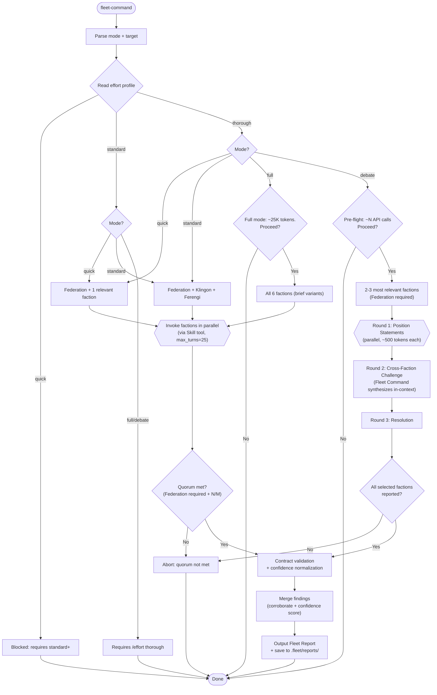
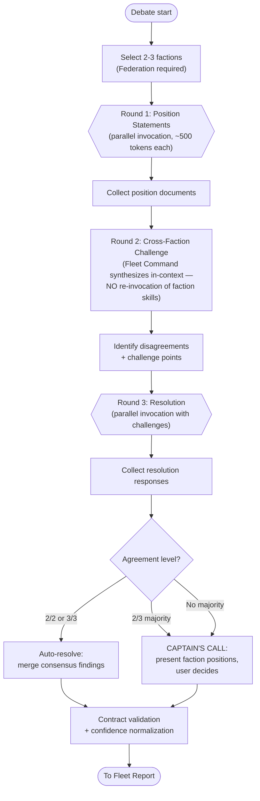

# /fleet-command — Fleet Command Multi-Faction Orchestrator

Composes faction reviews into unified fleet assessments. Each mode activates different factions for the appropriate level of scrutiny.

## Arguments

- `/fleet-command quick "<topic>"` — Federation + 1 relevant faction
- `/fleet-command standard "<topic>"` — Federation + Klingon + Ferengi (default)
- `/fleet-command full "<topic>"` — All 6 factions
- `/fleet-command debate "<topic>"` — 2-3 factions in structured debate
- `/fleet-command --holodeck "<topic>"` — Federation + Holodeck council (expertise-focused)
- `/fleet-command --file <path>` — Analyze a document (combines with any mode)

## Effort Profile Gating

**Before any mode**: Read `~/.claude/cache/current-effort-profile.json`. If missing, assume `standard`.

- `/effort quick` — Disabled entirely. Respond: "Fleet Command requires standard or thorough effort."
- `/effort standard` — Quick and Standard modes only. If user requests full/debate, respond: "Full/Debate mode requires `/effort thorough` (~7K-25K tokens). Switch effort first."
- `/effort thorough` — All modes available. Warn on full: "Full mode deploys 5 factions (~25K tokens). Proceed? [Y/n]"

## Faction Registry

| Faction | Skill | Perspective | Agents |
|---------|-------|-------------|--------|
| Federation | `/bridge-briefing` | Quality, defense, standards | 5 officers |
| Klingon Empire | `/klingon-review` | Security, attack simulation | 3 warriors |
| Romulan Star Empire | `/romulan-intel` | Strategy, hidden risks, opportunities | 3 operatives |
| Ferengi Alliance | `/ferengi-audit` | Cost, caching, ROI | 3 merchants |
| Borg Collective | `/borg-assimilate` | Self-learning, pattern extraction | Single agent |
| Holodeck Division | `/holodeck` | Deep expertise, domain methodology | 8 expert personas |

## Faction Templates

Faction behaviors are defined in TOML files at `factions/{name}.toml`. To add a new faction:
1. Create `factions/{name}.toml` following the schema
2. Add to the Faction Registry table
3. Add mode mapping in Mode Decisions

Template schema:
- `[faction]`: name, skill, perspective, agents, mandatory
- `[contract]`: required_fields, id_prefix
- `[confidence]`: native_type, mapping
- `[prompt]`: system prompt, focus_areas
- `[budget]`: max_turns, estimated_tokens

Fleet Command reads these templates at invocation to configure each faction's behavior.

## Mode Decisions

**Quick mode — faction selection by topic**:

| Topic Category | Factions |
|---------------|----------|
| Security | Federation + Klingon |
| Strategy/business | Federation + Romulan |
| Cost/optimization | Federation + Ferengi |
| Learning/improvement | Federation + Borg |
| Deep expertise/methodology | Federation + Holodeck (auto-routed expert) |

**Holodeck mode** (`--holodeck`): Federation + Holodeck council (2-3 experts selected by topic). Use when the question needs domain expertise rather than faction perspectives.

**Full mode**: All 6 factions use brief/quick variants to control token cost. Holodeck contributes a council of 3 relevant experts.

**Debate mode**: Maximum 3 factions. Default: Federation + Klingon + Ferengi (if topic ambiguous). Pre-flight confirmation required.

## Workflow



### Debate Mode Sub-Workflow



### Key Decisions

**Resilience**: Set `max_turns` to 25 per faction agent. If a faction fails or returns empty, log `**{Faction}**: FAILED — {reason}`.

**Quorum rules**:

| Mode | Minimum | Required |
|------|---------|----------|
| Quick | 1/2 | Federation |
| Standard | 2/3 | Federation |
| Full | 4/6 | Federation |
| Holodeck | 1/2 | Federation |
| Debate | all | all selected |

Federation is mandatory in all modes — if Federation fails, abort regardless. If quorum met but factions missing, add to report header: `**Incomplete**: {faction} did not report — findings may have blind spots in {perspective} coverage`

**Contract validation** — required fields per faction:
- Klingon: FINDING_ID, WARRIOR, FINDING, S_LEVEL, EXPLOITABILITY, LOCATION, ATTACK, FIX
- Romulan: FINDING_ID, OPERATIVE, FINDING, S_LEVEL, TYPE, CONFIDENCE, IMPACT, EVIDENCE, ACTION
- Ferengi: FINDING_ID, MERCHANT, FINDING, S_LEVEL, CATEGORY, ROI_SCORE, CURRENT_COST, SAVINGS, FIX

Missing fields: include at -0.1 confidence. Zero parseable findings: treat as faction failure (apply quorum rule).

**Confidence normalization**:

| Faction | Native Rating | Normalized | S_LEVEL Mapping |
|---------|--------------|------------|-----------------|
| Federation | ENGAGE (80-100) / CAUTION (50-79) / ALL STOP (0-49) | Score / 100 | B-NNN IDs with S0-S3 |
| Klingon | S0/S1/S2/S3 (direct) | S_LEVEL map: S0=0.9, S1=0.7, S2=0.5, S3=0.3 | Direct (K-NNN) |
| Romulan | Already 0.0-1.0 | Direct | Direct (R-NNN) |
| Ferengi | ROI 1-10 | ROI / 10 | Direct (F-NNN) |
| Borg | Consensus 0.3/0.5/0.7+ | Direct | N/A |
| Holodeck | Qualitative (no native score) | Default 0.6; HIGH=0.8, MEDIUM=0.5, LOW=0.3 if tagged | N/A |

**Finding normalization**:

| Common Field | Klingon Source | Romulan Source | Ferengi Source |
|-------------|---------------|----------------|----------------|
| FINDING_ID | K-NNN (direct) | R-NNN (direct) | F-NNN (direct) |
| SEVERITY | S_LEVEL (direct) | S_LEVEL (direct) | S_LEVEL (direct) |
| FINDING | FINDING (direct) | FINDING (direct) | FINDING (direct) |
| EVIDENCE | ATTACK | EVIDENCE | CURRENT_COST + SAVINGS |
| ACTION | FIX | ACTION | FIX or RECOMMENDATION |

Faction-specific extension fields (EXPLOITABILITY, TYPE, CATEGORY, etc.) preserved in per-faction detail sections.

**Cross-faction corroboration**: +0.1 per corroborating faction (cap 1.0). Map to categories: Security / Quality / Strategy / Cost / Learning. Rank by confidence, then impact.

**4-signal confidence scoring** (assimilated 2026-03-28): After collecting all faction outputs, score each faction's response using the confidence analyzer at `~/.claude/hooks/lib/confidence-analyzer.js`. The analyzer produces 4 independent signals: explicit markers (35%), linguistic hedging (25%), cross-agent consistency (25%), evidence density (15%). Pass all faction outputs as `peerTexts` to each faction's scoring call for cross-agent consistency. Include the analyzer's verdict (HIGH/MEDIUM/LOW/VERY_LOW) in the Faction Summary table's Confidence column. If any faction scores VERY_LOW, flag it in the report header.

**Cost tracking**: After each faction completes, record:
- Estimated token count: `toml_base + (actual_output_chars / 4)` where `toml_base` is from `budget.estimated_tokens` and 4 chars/token is the standard approximation. This auto-recalibrates with actual output size.
- Wall-clock duration (dispatch timestamp to completion timestamp)
- Finding count

Include the Cost Summary table in the Fleet Report between Faction Summary and Cross-Faction Findings.

### Cross-Faction Context Injection

When dispatching factions sequentially or collecting results:

**For parallel dispatch** (quick/standard/full modes): Factions run independently. After all complete, cross-reference findings during the merge step.

**For debate mode**: Each round injects prior round context:
- Round 1: No injection (independent position statements)
- Round 2: Fleet Command synthesizes Round 1 positions in-context (already specified)
- Round 3: Each faction receives their Round 1 position + all Round 2 challenges

**For sequential fallback** (when a faction depends on another's output): If a faction is dispatched after others complete, inject a 3-line summary of each completed faction's top finding:

```
Prior faction context:
- Federation: [top finding summary, 1 line]
- Klingon: [top finding summary, 1 line]
```

This is optional context, not mandatory. Factions must be able to produce findings without it.

**Anti-anchoring constraint**: When injecting prior faction context, append: "Do not repeat or elaborate on findings already flagged by prior factions. Focus on gaps and independent perspectives." This counteracts anchoring bias from seeing earlier results.

**Debate resolution**: 2-faction: 2/2 agreement for auto-resolve. 3-faction: 3/3 or CAPTAIN'S CALL with faction positions. Round 2 cross-challenge is synthesized by Fleet Command in-context (does NOT re-invoke faction skills).

### Output Format

```markdown
## Fleet Command Report — {timestamp}

**Target**: {description}
**Mode**: {quick/standard/full/debate}
**Factions deployed**: {list}
**Unified confidence**: {0.0-1.0}

### Faction Summary
> Include one row per deployed faction only. Omit factions not invoked in this mode.

| Faction | Rating | Top Finding | Confidence |
|---------|--------|-------------|------------|
| {faction} | {rating} | {finding} | {conf} |

### Cost Summary

| Faction | Tokens (est.) | Duration | Findings |
|---------|--------------|----------|----------|
| Federation | ~3,500 | 45s | 5 |
| Klingon | ~3,000 | 38s | 3 |
| Ferengi | ~2,500 | 32s | 4 |
| **Total** | **~9,000** | **115s** | **12** |

### Cross-Faction Findings (flagged by 2+ factions)
| ID | Finding | S | Factions | Category | Confidence | Action |
|----|---------|---|----------|----------|------------|--------|
| X-001 | {description} | S1 | {list} | {cat} | {conf} | {action} |

### Must-Fix Checklist
> Items at S0/S1 from any faction that require immediate action.
- [ ] X-001: {one-line summary}
- [ ] K-003: {one-line summary from single-faction}

### Single-Faction Findings
{Findings from only one faction, lower priority — use faction-native IDs (K-NNN, R-NNN, F-NNN, B-NNN, O-NNN)}

### Fleet Recommendation
{1-3 sentences synthesizing top findings into actionable guidance}

### Dissent
{Any faction that disagrees with the majority, with reasoning}
```

### Quote-and-Annotate Style

Faction reviews that analyze documents or code should quote specific passages:

**Format**:

```
[K-001] **Input Validation Missing** (S1, confidence: 0.85)
> Line 42: `req.body.webhook_url` passed directly to `fetch()` without validation
FINDING: Server-side request forgery via unvalidated URL parameter
FIX: Validate against allowlist of permitted domains before fetch
```

**Rules**:
- Quote the specific line, function, or passage that contains the issue
- Use `>` blockquote for the quoted passage
- Include line numbers or section references when available
- Each quote must be followed by the FINDING and FIX
- Do not quote large blocks (max 3 lines per quote)
- Weakness IDs (K-001, R-002, etc.) must be unique within the review

Add this instruction to each faction's dispatch prompt when analyzing files or code.

## State Persistence

Fleet Command checkpoints review state after each faction completes:

**State file**: `.fleet/state/{timestamp}-{slug}.yaml`

```yaml
review_id: "{timestamp}-{slug}"
target: "{description}"
mode: "{mode}"
started: "{ISO8601}"
status: "in_progress"  # in_progress | complete | failed

factions:
  federation:
    status: "complete"  # pending | running | complete | failed
    started: "{ISO8601}"
    completed: "{ISO8601}"
    findings_count: 5
    output_file: ".fleet/state/{review_id}/federation.md"
  klingon:
    status: "running"
    started: "{ISO8601}"
    # ...

quorum:
  required: 2
  met: false
  reporting: ["federation"]
```

**Checkpoint protocol**:
1. Create state file at review start (all factions "pending")
2. Update to "running" when each faction is dispatched
3. Update to "complete"/"failed" when each faction returns
4. Write faction output to `.fleet/state/{review_id}/{faction}.md`
5. Check quorum after each faction completes
6. On session recovery: read state file, skip completed factions, re-dispatch pending/running factions

**Recovery**: If a review is interrupted, invoke `/fleet-command --resume {review_id}` to continue from the last checkpoint. Use `/fleet-command --list-reviews` to discover interrupted reviews (reads `.fleet/state/` directory). The last review_id is also written to `.fleet/state/last.txt` on every run, so `--resume last` is always valid.

## File-Based Handoffs

To preserve context window, faction agents write findings to files rather than returning large outputs in-context:

1. Before dispatch, create output directory: `.fleet/state/{review_id}/`
2. Each faction agent writes its output to `.fleet/state/{review_id}/{faction}.md`
3. Fleet Command reads the file after faction completion (not the in-context return)
4. For the report, read only the findings section of each file (skip preamble)

**Agent prompt addition** (append to each faction invocation):

```
Write your complete findings to: {output_file}
Include all required contract fields in your findings.
Your in-context response should be a 3-line summary only.
```

This reduces context consumption from ~2000 tokens per faction to ~100 tokens, with full findings preserved on disk.

## Persistence

Save reports to `.fleet/reports/{YYYY-MM-DD-HHmm}-{slug}.md` in the project root. Create directory if needed.

## Token Budget

Estimates are for skill/persona prompt overhead only. Add reviewed artifact size (duplicated to each spawned agent) on top. Recommended max input: quick 200 lines, standard 500 lines, full 1000 lines.

| Mode | Prompt Overhead | + Artifact (500 lines) | API Calls |
|------|----------------|----------------------|-----------|
| Quick | ~3,500 | ~7,500 | 8-12 |
| Standard | ~5,000 | ~14,000 | 14-20 |
| Holodeck | ~4,500 | ~12,000 | 10-16 |
| Full | ~9,000 | ~32,000 | 25-38 |
| Debate | ~8,000 | ~20,000 | 12-18 (Rounds 2-3 in-context) |

## Verification

Run `/fleet-command quick "test topic"` with a simple topic. Expected:
- Fleet Command Report with `**Mode**: quick` and `**Factions deployed**: Federation + {1 faction}`
- Faction Summary table with exactly 2 rows (not 5)
- Cross-Faction Findings section present
- Fleet Recommendation present
- Report saved to `.fleet/reports/`

For full validation, run `/fleet-command standard` on a real feature. Expect 3 faction rows.

## Worked Example

**User**: `/fleet-command standard "Review the new webhook handler in src/api/webhooks.ts"`

**What happens**:
1. Fleet Command reads effort profile — `standard` allows Standard mode
2. Invokes 3 factions in parallel:
   - Federation (`/bridge-briefing`): 5 officers evaluate code quality, architecture, error handling
   - Klingon (`/klingon-review`): 3 warriors red-team for injection, SSRF, auth bypass
   - Ferengi (`/ferengi-audit`): 3 merchants assess token efficiency and caching opportunities
3. Collects all findings, validates output contracts, normalizes confidence scores
4. Cross-faction corroboration: Klingon and Federation both flag missing input validation → confidence +0.1
5. Outputs unified Fleet Report with cross-faction findings ranked by confidence

**Output**: Fleet Command Report saved to `.fleet/reports/2026-03-07-webhook-handler.md` with Faction Summary table (3 rows), Cross-Faction Findings, and Fleet Recommendation.

## Troubleshooting

| Symptom | Cause | Fix |
|---------|-------|-----|
| Federation faction fails, whole run aborts | Federation is mandatory for quorum | Check bridge-briefing skill and officer persona files exist |
| Faction returns empty findings | Artifact too short or too generic for meaningful analysis | Provide at least 50 lines of specific code/design, not just descriptions |
| Report missing Cross-Faction Findings | Only 1 faction deployed (quick mode) | Cross-faction requires 2+ factions; use `standard` or `full` mode |
| "Fleet Command requires standard or thorough effort" | Effort profile set to `quick` | Run `/effort standard` first |
| Debate mode never converges | Fundamentally opposed perspectives on the topic | Expected behavior; CAPTAIN'S CALL presented for user decision |

## Notes

- No always-on overhead (loaded on demand)
- Each faction skill handles its own agent spawning — Fleet Command just orchestrates
- Debate mode is the most expensive but produces the highest-quality analysis
- For simple code review, use a single faction directly instead of Fleet Command
