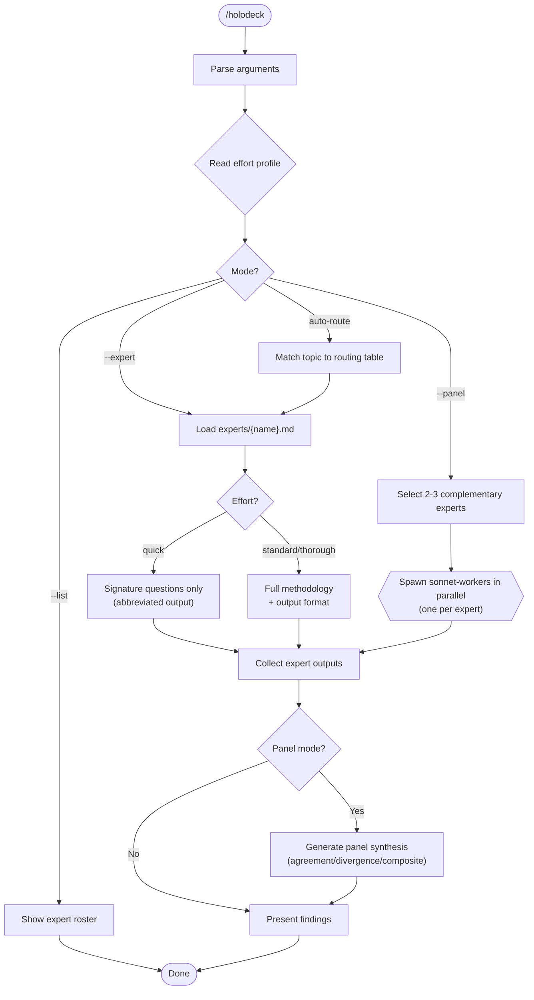

# /holodeck -- Expert Persona Analysis

> "Computer, activate program."

Invokes historical and fictional expert personas for deep domain-specific analysis. Where factions (Federation, Klingon, Romulan, Ferengi) organize by *allegiance*, the Holodeck organizes by *intellectual methodology*. Each persona brings an authentic analytical tradition to bear on any problem.

## Arguments

- `/holodeck "<topic>"` -- Auto-route to best-fit expert
- `/holodeck --expert <name> "<topic>"` -- Invoke a specific expert
- `/holodeck --panel "<topic>"` -- Compose 2-3 complementary experts
- `/holodeck --list` -- Show available experts and their domains
- `/holodeck --file <path>` -- Apply expert analysis to a file (combines with any mode)

## Effort Profile Gating

**Before invocation**: Read `~/.claude/cache/current-effort-profile.json`. If missing, assume `standard`.

- `/effort quick` -- Single expert, abbreviated: signature questions only, no full output format
- `/effort standard` -- Single expert, full methodology and output format. If user requests `--panel`, respond: "Panel mode requires `/effort thorough` (~8K tokens per expert). Switch effort first."
- `/effort thorough` -- Panel mode available; each expert runs full methodology; synthesis included

## Expert Roster

| Slug | Name | Domain | Trigger Topics |
|------|------|--------|----------------|
| `socrates` | Socrates | Assumption audit, first-principles | "Is this assumption valid?", vague requirements, inherited designs |
| `holmes` | Sherlock Holmes | Deduction, root cause, anomaly detection | Debugging, post-incident, "why is this failing?" |
| `sun-tzu` | Sun Tzu | Strategy, positioning, resource allocation | Build vs buy, migration, competitive analysis |
| `da-vinci` | Leonardo da Vinci | Cross-domain synthesis, systems thinking | Architecture, "solved problem elsewhere?", elegance |
| `curie` | Marie Curie | Scientific method, measurement, experiments | Performance claims, test design, "prove it works" |
| `lovelace` | Ada Lovelace | Algorithms, abstraction, computational limits | Algorithm design, abstraction review, edge cases |
| `feynman` | Richard Feynman | Simplification, BS detection, clarity | Over-engineering, docs review, "explain it simply" |
| `hopper` | Grace Hopper | Pragmatic engineering, legacy, shipping | Legacy constraints, "just ship it", theory vs practice |

## Auto-Routing

When `/holodeck "<topic>"` is called without `--expert`, select based on topic shape:

| Topic Shape | Best-Fit Expert |
|-------------|-----------------|
| "Is this assumption valid?" / requirements clarity | Socrates |
| "Why is this failing?" / root cause / debugging | Holmes |
| Build vs buy / competitive / migration strategy | Sun Tzu |
| "Solved problem elsewhere?" / cross-domain / architecture elegance | Da Vinci |
| "Prove it works" / performance claims / test design | Curie |
| "Right algorithm?" / abstraction design / edge cases | Lovelace |
| "Too complex" / explain simply / BS detection | Feynman |
| Legacy constraints / theory vs practice / deployment blockers | Hopper |

## Panel Mode

`/holodeck --panel` composes 2-3 experts with orthogonal lenses. Runs experts in parallel (one sonnet-worker per expert), produces composite report with synthesis section.

### Recommended Panels

| Panel Name | Experts | Use Case |
|------------|---------|----------|
| First Principles | Socrates + Feynman | "Should we build this at all? And can we explain why?" |
| The Investigation | Holmes + Curie | "What is actually happening here? Prove it." |
| The Campaign | Sun Tzu + Hopper | "Can we win, and can we ship it?" |
| The Synthesis | Da Vinci + Lovelace | "Is this the right design for this computation?" |
| Full Inquest | Socrates + Holmes + Curie | Deep validation of any complex claim |
| Architecture Council | Da Vinci + Lovelace + Feynman | System design review |

### Panel Synthesis

After collecting all expert outputs, produce:

```markdown
## Holodeck Panel Synthesis

**Experts consulted**: {list}
**Subject**: {topic}

### Points of Agreement
{Where experts' analyses converge -- HIGH confidence findings}

### Points of Divergence
{Where experts see differently -- what the divergence reveals}

### Composite Insight
{What emerges from combining these lenses that no single expert would see}
```

## Subagent Configuration

Each expert spawns as a `sonnet-worker` subagent. Prompt template:

```
You are {expert name}. Follow the analytical methodology in your profile exactly.

EXPERT PROFILE:
{contents of experts/{slug}.md}

SUBJECT FOR ANALYSIS:
{topic, code, or document provided by user}

{If --file provided: RELEVANT CODE:\n{file contents}}

Apply your methodology fully. Use your output format exactly.
Do not step outside your scope boundaries -- if the question is outside
your domain, state that clearly rather than fabricating expertise.
Your characteristic phrases are yours to use -- they signal which
analytical mode is active, not decoration.
```

**Context bundle** (per GAAI assimilation): Include in the prompt any known friction from `~/.claude/cache/friction-log.jsonl` related to the target files. If the file is absent or empty, omit friction context -- do not error.

## Integration with Fleet Command

The Holodeck Division is the 6th faction in Fleet Command:

| Fleet-Command Mode | Holodeck Addition |
|--------------------|-------------------|
| `/fleet-command quick --holodeck` | Federation + auto-routed Holodeck expert |
| `/fleet-command full` | All 6 factions including Holodeck council (3 relevant experts) |
| L3 quality gate | Add Socrates for assumption audit |
| L7 quality gate | Add Sun Tzu + Da Vinci |
| L8 quality gate | Full Inquest panel (Socrates + Holmes + Curie) |

## Workflow



## Persona File Format

Each expert lives in `experts/{slug}.md`:

```markdown
# {Name} -- {Domain Title}

{One-sentence identity}

## Expertise Domain
{What they analyze and -- equally important -- what they do NOT}

## Analytical Methodology
{Authentic step-by-step reasoning process, 3-5 steps}

## Signature Questions
{3-5 questions that make this persona uniquely valuable}

## Output Format
{Structured output template with persona-specific headers}

## Scope Boundaries
**Analyzes:** {specific domains}
**Ignores:** {things outside their lens}

## Characteristic Phrases
{3-5 in-character phrases that signal the active analytical mode}
```

## Troubleshooting

| Symptom | Cause | Fix |
|---------|-------|-----|
| "No expert matched topic" | Auto-routing couldn't classify | Use `--expert <name>` explicitly |
| Panel mode blocked | Effort profile set to quick/standard | Run `/effort thorough` first |
| Expert scope warning | Topic outside expert's domain | Normal -- expert honestly declines. Try different expert |
| Empty output from expert | Topic too vague | Provide specific code, design doc, or decision to analyze |

## Notes

- No always-on overhead (loaded on demand via Skill tool)
- Each expert persona is authentic to the historical/fictional figure
- Scope boundaries prevent fabricated expertise -- an honest "outside my domain" is valuable
- Panel mode is the most thorough but costs 2-3x a single expert
