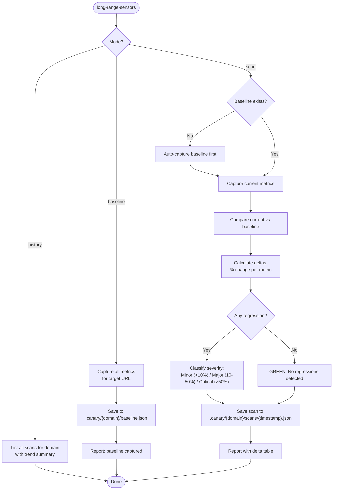

# /long-range-sensors -- Post-Deploy Canary

Capture baseline metrics from a deployed application, then detect regressions on subsequent runs. Relative comparison (before vs after), not absolute thresholds.

## Arguments

- `/long-range-sensors baseline <url>` -- capture baseline metrics
- `/long-range-sensors scan <url>` -- scan and compare against baseline
- `/long-range-sensors compare <url>` -- alias for scan
- `/long-range-sensors history <url>` -- show scan history for a domain

## Prerequisites

- Target URL must be reachable
- `curl` available for HTTP checks
- Playwright MCP for browser-based metrics (optional; degrades gracefully)

## Metrics Captured

| Metric | Method | Unit |
|--------|--------|------|
| Response time | `curl -w '%{time_total}'` | seconds |
| HTTP status | `curl -o /dev/null -s -w '%{http_code}'` | status code |
| Response size | `curl -s -o /dev/null -w '%{size_download}'` | bytes |
| Page load time | Playwright `performance.timing` | ms |
| Console errors | Playwright console listener | count |
| Broken links | Crawl internal links, check status | count |
| DOM element count | `document.querySelectorAll('*').length` | count |
| Image count | `document.images.length` | count |

When Playwright is unavailable, browser-based metrics are skipped and the scan runs HTTP-only.

## Workflow



## Regression Detection

Deltas are calculated as percentage change from baseline:

```
delta = ((current - baseline) / baseline) * 100
```

**Regression classification**:

| Delta | Response Time | Response Size | Console Errors | Broken Links |
|-------|--------------|---------------|----------------|-------------|
| Minor | +10-25% | +/- 10-25% | +1-2 | +1 |
| Major | +25-50% | +/- 25-50% | +3-5 | +2-3 |
| Critical | +50%+ | +/- 50%+ | +5+ | +4+ |

**Direction matters**: Response time increase = bad. Response size decrease (>25%) = suspicious (missing content?). Console errors increase = always bad.

## Report Format

```markdown
## Canary Report -- {url}

**Date**: {YYYY-MM-DD HH:mm}
**Baseline**: {baseline date}
**Overall**: {GREEN|AMBER|RED}

### Metric Comparison

| Metric | Baseline | Current | Delta | Status |
|--------|----------|---------|-------|--------|
| Response time | 0.42s | 0.51s | +21% | MINOR |
| HTTP status | 200 | 200 | -- | OK |
| Response size | 45.2KB | 44.8KB | -1% | OK |
| Page load | 1.2s | 1.4s | +17% | MINOR |
| Console errors | 0 | 3 | +3 | MAJOR |
| Broken links | 0 | 0 | -- | OK |

### Regressions Detected

- **MAJOR**: Console errors increased from 0 to 3
  - `TypeError: Cannot read property 'map' of undefined` (3x on /dashboard)
- **MINOR**: Response time increased 21% (0.42s -> 0.51s)

### Recommendation

{Actionable guidance based on findings}
```

## Persistence

```
.canary/
  {domain}/
    baseline.json       # Latest baseline
    scans/
      {timestamp}.json  # Each scan result
```

JSON format for both baseline and scans:
```json
{
  "url": "https://example.com",
  "timestamp": "2026-03-23T14:00:00Z",
  "metrics": {
    "response_time": 0.42,
    "http_status": 200,
    "response_size": 46284,
    "page_load_ms": 1200,
    "console_errors": 0,
    "broken_links": 0,
    "dom_elements": 847,
    "image_count": 12
  }
}
```

## Multi-Page Scan

When scanning a URL:
1. Scan the provided URL (homepage/entry point)
2. Discover up to 10 internal links from that page
3. Scan each discovered page
4. Report per-page metrics + aggregate

Baseline captures the same page set. Subsequent scans match against the same pages.

## Worked Example

**User**: `/long-range-sensors baseline https://staging.myapp.com`

1. Captures metrics for homepage + 8 discovered internal pages
2. Saves to `.canary/staging.myapp.com/baseline.json`
3. Reports: "Baseline captured: 9 pages, avg response 0.38s, 0 console errors, 0 broken links."

*Later, after deploying a change:*

**User**: `/long-range-sensors scan https://staging.myapp.com`

1. Re-captures same 9 pages
2. Compares against baseline
3. Finds: +3 console errors on /dashboard, +15% response time on /api/data
4. Reports: AMBER (1 MAJOR, 1 MINOR regression)

## Troubleshooting

| Symptom | Cause | Fix |
|---------|-------|-----|
| "No baseline found" | First scan for this domain | Run `baseline` mode first, or scan will auto-capture |
| All metrics show 0% delta | Baseline and scan are identical | Expected if nothing changed |
| Browser metrics all skipped | Playwright not available | Install Playwright MCP for full metrics; HTTP-only still useful |
| Response time varies wildly | Network/server variability | Run baseline and scan under similar conditions; consider averaging 3 runs |
| "Domain mismatch" | URL differs from baseline URL | Use same URL for baseline and scan (including protocol and path) |
