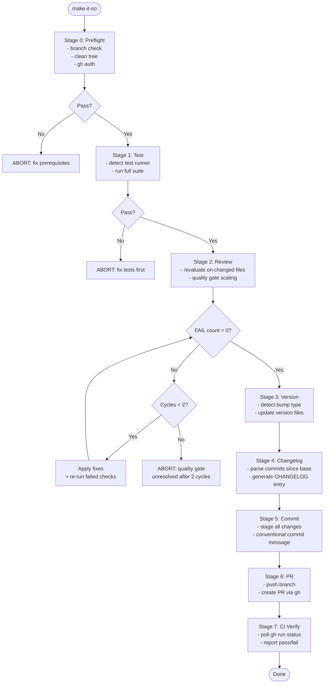

# /make-it-so -- Release Pipeline

End-to-end release pipeline from working code to merged PR. Orchestrates existing skills with quality gates between each stage.

## Arguments

- `/make-it-so` -- auto-detect version bump from conventional commits
- `/make-it-so patch|minor|major` -- explicit semver bump
- `/make-it-so --dry-run` -- run pipeline without committing or pushing
- `/make-it-so --skip-tests` -- skip test stage (use only when tests already passed this session)
- `/make-it-so --base <branch>` -- target branch for PR (default: main)

## Prerequisites

Before invoking, verify:
1. All implementation work is complete (no TODO/FIXME in changed files)
2. Working directory is clean or changes are staged
3. You are on a feature branch (not main/master)
4. `gh` CLI is authenticated

## Pipeline Stages



## Stage Details

### Stage 0: Preflight

```bash
# Branch safety
BRANCH=$(git branch --show-current)
if [ "$BRANCH" = "main" ] || [ "$BRANCH" = "master" ]; then
    echo "ABORT: Cannot release from $BRANCH. Create a feature branch first."
    exit 1
fi

# Working tree check
if [ -n "$(git status --porcelain)" ]; then
    echo "WARNING: Unstaged changes detected. Stage or stash before proceeding."
fi

# GitHub CLI auth
gh auth status 2>&1 || echo "ABORT: gh not authenticated. Run 'gh auth login'."

# Base branch existence
git rev-parse --verify origin/${BASE_BRANCH:-main} 2>/dev/null || echo "ABORT: base branch not found"
```

If any check fails, report clearly and stop. Do not proceed with a broken preflight.

### Stage 1: Test

Detect test runner from project files:

| Signal | Runner | Command |
|--------|--------|---------|
| `package.json` has `test` script | npm | `npm test` |
| `pytest.ini` or `pyproject.toml` `[tool.pytest]` | pytest | `pytest` or `uv run pytest` |
| `Cargo.toml` | cargo | `cargo test` |
| `go.mod` | go | `go test ./...` |
| `Makefile` has `test` target | make | `make test` |

Run the detected suite. If tests fail, report the failures and ABORT. Do not proceed to review with failing tests.

If `--skip-tests` flag is set, log "Tests skipped (user override)" and proceed.

### Stage 2: Review

Run `/evaluate` on all changed files (via `git diff --name-only ${BASE_BRANCH}...HEAD`).

The evaluate skill auto-scales review intensity based on change scope. Follow its recommendations for quality gate level.

**Gate**: If any FAIL-severity issues remain after 2 fix cycles, ABORT with the issue list. The user must resolve them manually before re-running `/make-it-so`.

### Stage 3: Version

**Auto-detection** (when no explicit bump given):

Parse commits since divergence from base branch using conventional commit prefixes:

| Prefix | Bump |
|--------|------|
| `feat!:` or `BREAKING CHANGE:` in body | major |
| `feat:` | minor |
| `fix:`, `refactor:`, `perf:`, `docs:`, `chore:`, `test:`, `style:`, `ci:` | patch |

Use the highest bump detected. If no conventional commits found, default to `patch`.

**Version file detection** (check in order, update first match):

| File | Pattern |
|------|---------|
| `package.json` | `"version": "X.Y.Z"` |
| `pyproject.toml` | `version = "X.Y.Z"` |
| `Cargo.toml` | `version = "X.Y.Z"` |
| `VERSION` | plain `X.Y.Z` |

If no version file exists, skip version bump (some projects don't use semver). Log "No version file found, skipping version bump."

Present the proposed bump to the user: "Version bump: 1.2.3 -> 1.3.0 (minor, detected from feat: commits). Proceed? [Y/n]"

### Stage 4: Changelog

Generate a changelog entry from commits since base branch:

```markdown
## [X.Y.Z] - YYYY-MM-DD

### Added
- feat: descriptions...

### Fixed
- fix: descriptions...

### Changed
- refactor/perf: descriptions...
```

If `CHANGELOG.md` exists, prepend the new entry after the first `# Changelog` header. If it does not exist, create it.

If no version file was found in Stage 3, use the current date as the section header instead of a version number.

### Stage 5: Commit

Stage all modified files (version bump + changelog). Create a commit with conventional format:

- If version bumped: `release: vX.Y.Z`
- If no version: `chore: prepare release YYYY-MM-DD`

Include `Co-Authored-By` trailer per repository conventions.

**Confirm with user before committing.**

### Stage 6: PR

Push the branch and create a PR:

```bash
git push -u origin HEAD
```

Create PR with `gh pr create`:
- **Title**: `release: vX.Y.Z` or branch-derived title
- **Body**: Changelog entry + test results summary + review score
- **Labels**: add `release` label if available
- **Base**: `--base ${BASE_BRANCH:-main}`

Present the PR URL to the user.

### Stage 7: CI Verify

Poll CI status for up to 5 minutes:

```bash
gh run list --branch $(git branch --show-current) --limit 1 --json status,conclusion
```

Report:
- **All green**: "CI passed. PR is ready for merge."
- **Failures**: "CI failed: {details}. Review the failures before merging."
- **Timeout**: "CI still running after 5 minutes. Check status manually: {url}"
- **No CI**: "No CI workflow detected. Consider adding one."

## Dry Run Mode

When `--dry-run` is set:
- Stages 0-2 run normally (preflight, test, review)
- Stage 3 shows proposed version bump but does not modify files
- Stage 4 shows proposed changelog but does not write
- Stages 5-7 are skipped entirely
- Output: "Dry run complete. Pipeline would: bump to vX.Y.Z, add N changelog entries, create PR to {base}."

## Abort and Recovery

If the pipeline aborts at any stage:
1. No partial commits are created (changes remain uncommitted)
2. Report which stage failed and why
3. Suggest specific fix actions
4. User can re-run `/make-it-so` after fixing

If the pipeline fails after commit (Stage 6-7):
1. The commit exists locally
2. Report: "Commit created but PR/CI failed. Fix the issue and run `/make-it-so` again (it will detect the existing commit)."

## Worked Example

**User**: `/make-it-so`

1. **Preflight**: Branch `feat/auth-improvements`, clean tree, gh authenticated
2. **Test**: Detected `npm test`, 47 tests pass
3. **Review**: `/evaluate` on 4 changed files, Level 3 review, 0 FAILs, 2 suggestions accepted
4. **Version**: 3 `feat:` commits detected, bump minor: 2.1.0 -> 2.2.0. User confirms.
5. **Changelog**: Added 3 entries under `## [2.2.0] - 2026-03-23`
6. **Commit**: `release: v2.2.0` with Co-Authored-By
7. **PR**: Created PR #42, CI running...
8. **CI**: All checks passed in 2m14s

Output: "PR #42 is green and ready for merge. Make it so, Number One."

## Troubleshooting

| Symptom | Cause | Fix |
|---------|-------|-----|
| "Cannot release from main" | On main/master branch | Create feature branch: `git checkout -b feat/your-feature` |
| Tests fail but code works | Test runner not detected | Check test runner detection table; add explicit `--skip-tests` if tests ran earlier |
| "gh not authenticated" | GitHub CLI needs login | Run `gh auth login` |
| Version bump wrong type | Commit prefixes ambiguous | Use explicit: `/make-it-so minor` |
| CI timeout | Slow CI pipeline | Check manually via PR URL; CI may still pass |
| No version file found | Project doesn't use semver | Expected; pipeline skips version bump gracefully |
| PR creation fails | Branch not pushed or permissions | Check `git push` permissions and repo write access |
